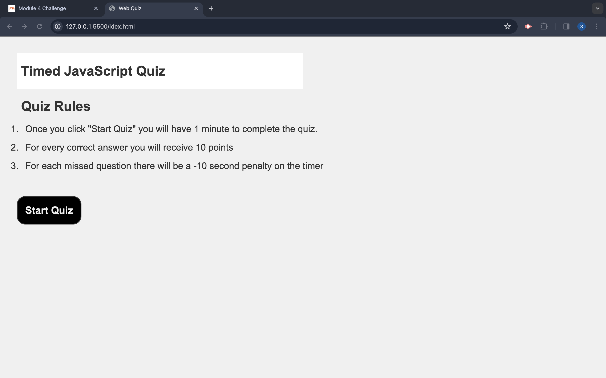

# Title: JavaScript Coding Quiz Application 

## Description: 
For this project, I utilized JavaScript to create a timed multiple-choice quiz application. The application incorporates a countdown timer and a scoring mechanism, which records and exhibits the user's current score as well as their highest score upon finishing. Additionally, it includes a penalty system where users lose 10 seconds from the timer for each incorrect answer.

## 

## Link to Deployed Application: 
[click here](https://sambishop06.github.io/JavaScript-Quiz/) 

## Installation: 
[Visual Studio Code](https://code.visualstudio.com/download)
